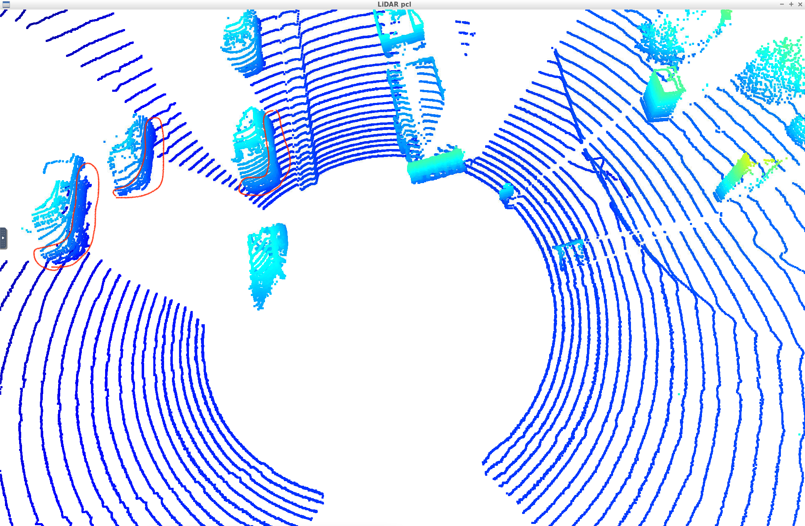
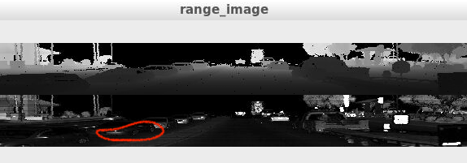
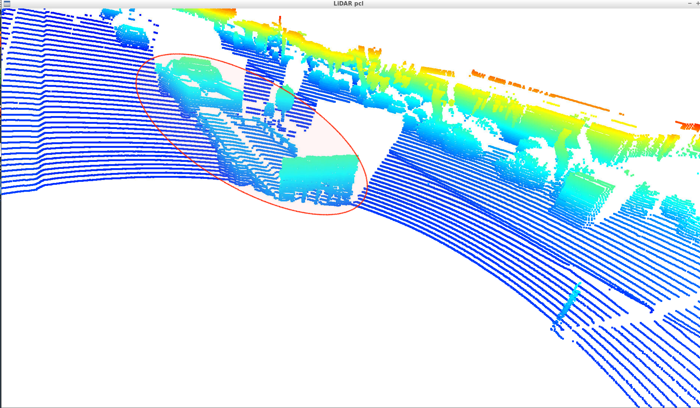
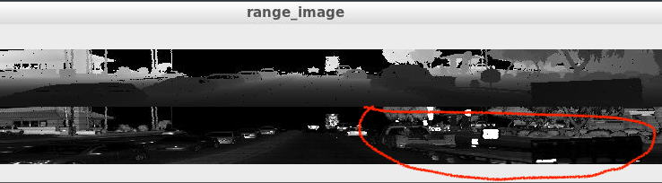
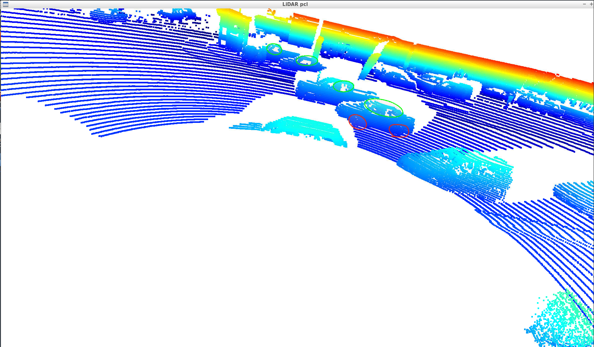
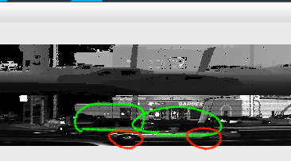

# Writeup: Mid-Term Project: 3D Object Detection

## Observation from point-cloud and coresponding range image
1. The bottom part of vehicles

    As shown below, we could observed the points in blue with higher density shows us that should be the bottom of vehicles. Because the more blue the point is the distance between point and the ground is much closer.
And the blue points are surrounding to a object on the road, those might be the bottom part of vehicles.

    Also, we could confirm our guess on the range image show below which is captured at the same moment.
    

2. A shape of a truck.

    Refer to the red circle of above image, obviously, we guess it would be a truck-like vehicle. And it's clearly to see the truck on the range image.
    

3. The window and the tires.

    Refer to the above image, the red circle shows the tires of a vehicle and the green circle shows the window of it.
    We could observe the tires by the shape of blue points. and we know the window is made by glass, so it reflects less laser from the glass to the receiver, we could see there is fewer point on the region. So it make sense to guess they are windows.
    Also check our guess is correct or not, the following range image shows that we guess right.
    