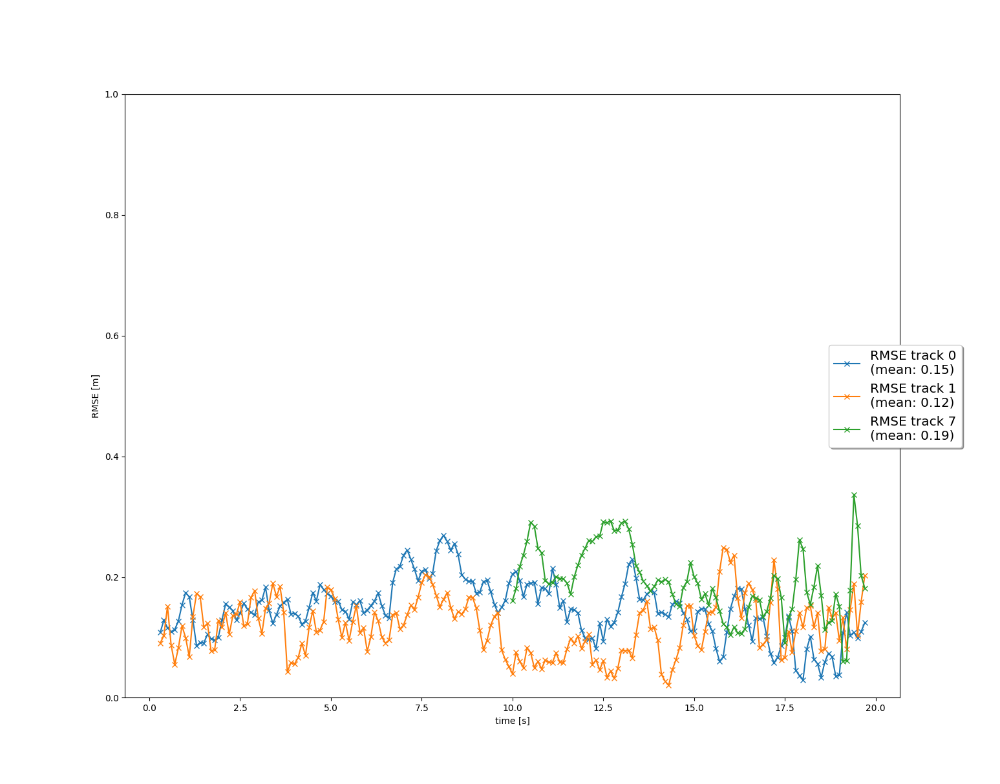

# Writeup: Track 3D-Objects Over Time

The final result of sequence 1 is shown below:

There are three confirmed tracks whose mean RMSE are below 0.20.

Please use this starter template to answer the following questions:

### 1. Write a short recap of the four tracking steps and what you implemented there (filter, track management, association, camera fusion). Which results did you achieve? Which part of the project was most difficult for you to complete, and why?
First we implement EKF at filter.py which includes state prediction and measurement update.

Second, we implement two kind of sensor which are lidar and camera in Measurement and Sensor class of measurements.py. Once a measurement arrived, we could update our state with different sensors by transform the coordinates.

Third, we have Track and Trackmanagement class implemented in trackmanagement.py to add each unassigned tracks we've found and delete those tracks with lower score or larger error estimation covariance.

Then, in order to associate the measurement and the track, we implement a Association class in association.py to associate tracks and measurements by calculating MHD and filtering by the gating method. 

### 2. Do you see any benefits in camera-lidar fusion compared to lidar-only tracking (in theory and in your concrete results)? 
For the sequence 1, I don't see a huge benefits after including a camera sensor into the system. But one observation is that if the vehicle is detected both by the lidar and the camera, the state turns into 'confirmed' quicker than before.

### 3. Which challenges will a sensor fusion system face in real-life scenarios? Did you see any of these challenges in the project?
The association problem is really hard to solve. There are lots of scenarios of those measurments and tracks, we have to figure out one association algorithm to associate those correctly.

### 4. Can you think of ways to improve your tracking results in the future?

1. Fine-tune your parameterization and see how low an RMSE you can achieve! One idea would be to apply the standard deviation values for lidar that you found in the mid-term project. The parameters in misc/params.py should enable a first running tracking, but there is still a lot of room for improvement through parameter tuning!
2. Implement a more advanced data association, e.g. Global Nearest Neighbor (GNN) or Joint Probabilistic Data Association (JPDA).
3. Feed your camera detections from Project 1 to the tracking.
4. Adapt the Kalman filter to also estimate the object's width, length, and height, instead of simply using the unfiltered lidar detections as we did.
5. Use a non-linear motion model, e.g. a bicycle model, which is more appropriate for vehicle movement than our linear motion model, since a vehicle can only move forward or backward, not in any direction.

